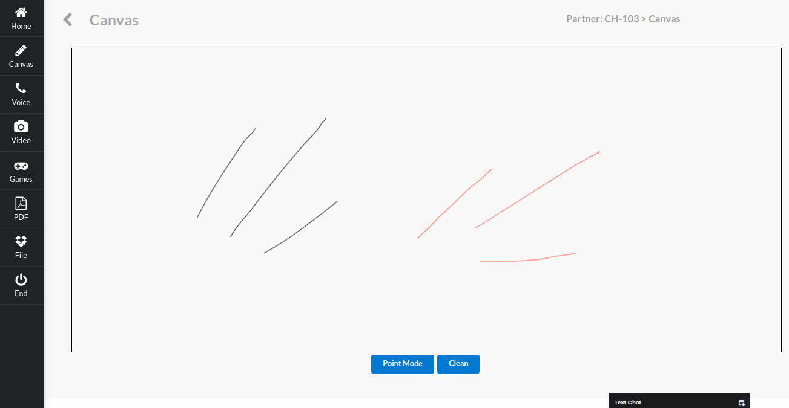

# Whiteboard

Collaborative pdf sharing, real-time scrolling, annotating platform.
Use of propietory protocol across clients for message exchange in chatting an gaming.

>  https://white-board.ml

-  ## Technology
    - Express.js 
    - React 
    - WebRTC 
    - Native Canvas 
    - Socket.io
    - Peer.js
    - Webpack
    - Turn Server
    - Stun Server

- ## Features
    - Real time video call
    - Audio call
    - Canvas
    - PDF sharing
    - Gaming hub
        - Chess
        - Snake Duel

## Screenshots

